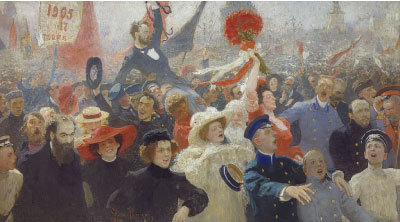

 
Upcoming presentation: 2018 Aug 25th, ECPR General Conference, Hamburg.

Parties in the Streets of Europe: A Comparative Assessment (co-authored with <a href="http://www.swen-hutter.eu/" target="_blank">Swen Hutter</a>)
------
Bridging the social movement and the party competition literature, the paper studies the interaction between the two arenas of political competition through a comparative analysis of party-sponsored protests in Europe. Social movements and political parties provide the two most important channels of democratic representation. Yet, despite their role in understanding social transformations, the two strands of literature developed independently, and their interaction is rarely examined. As modes of representation change due to the transformation of party organizations and the dominance of new social movements in protest politics, party sponsored protests allow to examine the form and the extent to which parties are willing to leave their ‘home’, the electoral arena, and engage society in the protest arena. Therefore, the paper fills a gap in the literature by providing the first comparative analysis of party sponsored protests as an example of the interaction between the two arenas.
The paper relies on a novel protest event dataset, collected by semi-automated content analysis of 10 English language news agencies. The data covers protests that took place in 30 European democracies between 2000 and 2015. The data was collected by the ERC project Political Conflict in Europe in the Shadow of the Great Recession (POLCON) and the SNF project Years of Turmoil (YoT). In a field dominated by the scarcity of comparative data, it provides the first opportunity to examine party sponsored protests in a cross-regional, comparative setting. As a first step in mapping the dynamic of party sponsored protests, the analysis paints the ‘big picture’ of the extent of the phenomenon and some its drivers.
While the over-time evolution of parties is often told as a story of increasing professionalization and withdrawal from society, the extent to which they sponsor protests vary. First, in weakly institutionalized party systems, parties are more likely to protest. Second, parties position in the party system affects their willingness to engage in the protest arena. Opposition parties, and electorally more popular formations are more likely to protest. However, electoral loss also contributes to parties’ willingness to protest on the 'streets'. Third, despite the general decline of mass party organizations, parties which are better organized and linked to other social actors are more likely to protest. Fourth, not all parties are likely to protest to the same extent. Parties on the left are more likely to protest in Western Europe, whereas in Eastern Europe, parties on the right are more prone to protest. In both macro-regions, radical parties are more likely to protest than their moderate counter-parts. Finally, once parties decide to protest, the extent to which they engage depends on the issue of the protest event. Relative to their focus in the electoral arena, parties shift their appeal in the protest arena towards the general dynamic of protests in their country.

Different worlds of contention? Left and right protest across Europe (co-authored with <a href="https://me.eui.eu/theresa-elena-gessler/" target="_blank">Theresa Gessler</a>)
------
The social movement literature argues that while citizens and parties on the left readily use protest mobilisation, citizens and parties on the right only settle for it as a ‘second best option’ after electoral defeat. However, most studies are based on aggregated cross-national comparisons or only include North-Western Europe. We contend the aggregate-level perspective hides a fundamentally different dynamic of protest in different parts of Europe: In Eastern Europe, citizens who identify as right are more likely to protest than citizens who identify as left. Based on individual level data, we replicate the findings of the literature for North-Western and Southern Europe and propose a different pattern for Eastern Europe. We explain these differences by historical legacies: exposure to communism as well as the different effect of mobilizing organizations and values contribute to diverging patterns of protest.
