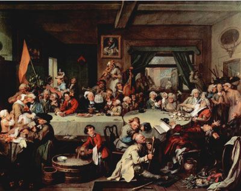

 
Upcoming presentation: -

The effect of electoral coordination on voting behaviour: Leveraging a quasi-experiment during the parliamentary elections in Hungary in 1998 - (co-authored with <a href="https://www.mzes.uni-mannheim.de/d7/en/profiles/alejandro-ecker" target="_blank">Alejandro Ecker</a>)
------
While a series of recent studies ask which parties are more likely to form pre-electoral coalitions, little is known about their effect on the demand side of the electoral market. Are political parties forming a pre-electoral coalition able to win more votes than if running independently? Or are they merely able to garner just as much or even less electoral support? Leveraging a quasi-experiment during the 1998 Hungarian parliamentary elections the present paper aims to shed light on this research question. Specifically, it explores whether electoral coordination between Fidesz-MPP and the MDF had a vote subadditive, vote additive, or a vote superadditive effect. Combing a difference-in-differences design with matching techniques to account for non-random assignment of joint candidacies to single-member districts, the present paper finds a substantive and robust vote subadditive effect of approximately two percentage points in legislative votes. This finding has substantive implications for our understanding of the effect of electoral coordination on individual voting behaviour. 

Breaking Up in Hard Times: Mass Party Organizations and Voters' Defection during the Great Recession
------
In many European countries, electoral punishment for the Great Recession went beyond governing parties and affected other parties in the political mainstream. As the paper argues, voters’ decision to defect was driven by two individual-level attitudes: economic dissatisfaction and ideological misrepresentation. However, not all parties were equally likely to see their vote share decline. Parties which invested into building mass-party organizations were better prepared to face the crisis. Mass party organizations were able to weaken the effect of electoral punishment, even in the case of governments in charge with crisis management.
The paper provides a comprehensive assessment of voters’ defection, based on the difference between their vote in the previous election and their future vote intention, as reported in the last two waves of the European Election Studies (2009, 2014). Mass party organizations are measured by two waves of an expert survey in twenty-five European countries (2008, 2013). The results of a multilevel logistic regression analysis and statistical matching techniques confirm the moderating role of mass party organizations in the defection of economically dissatisfied or ideologically misrepresented groups of voters.

